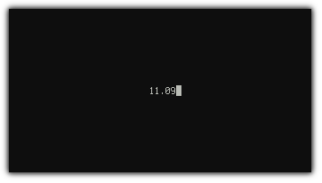

Introduction
============

`cl-charms` is an interface to `libcurses` in Common Lisp. It provides
both a raw, low-level interface to `libcurses` via CFFI, and a more
higher-level lispier interface.

It is intended to succeed `cl-ncurses`, which used the less portable
UFFI instead of CFFI for foreign bindings. Indeed, `cl-charms`
includes portions of code from `cl-ncurses`, and is largely a direct
translation of the latter's UFFI definitions to CFFI.

Currently, the low-level interface (the package `charms/ll`) is
probably feature-equivalent to `cl-ncurses` and compatible with client
code. In the future, however, `cl-charms` may break compatibility with
`cl-ncurses`.

`cl-charms` has been developed by its original author, Abhishek Reddy
(abhishek@abhishek.geek.nz), since beginning of October 2010 for quite
some time, then abandoned for unknown reason. After that, in 2014,
Mark Fedurin (hitecnologys@gmail.com) took responsibility for keeping
the library in working state. Robert Smith (quad@symbo1ics.com) began
to fix up the CFFI bindings and provide a friendlier interface.

The software is released under an MIT-style license. See the file
`COPYING` for details.

>    The imitator dooms himself to hopeless mediocrity. The
>    inventor did it because it was natural to him, and so in him
>    it has a charm. In the imitator something else is natural, and
>    he bereaves himself of his own beauty, to come short of
>    another man's.
          -- R.W. Emerson on originality.

Version
=======

Versioning roughly follows the scheme described in
[Semantic Versioning](http://semver.org/). Only "releases" will be
versioned.

Since we are still pre-`1.0.0`, the minor version will indicate API
breakage. Despite being pre-`1.0.0`, what exists in the low-level
interface as of now is quite usable for ASCII usage. We consider this
"beta" quality. The high-level functionality is considered "alpha"
quality.


Portability
===========

`cl-charms` has been tested to work to a reasonable extent (e.g.,
example code runs) on the following platforms:

* SBCL 1.1.8--1.2.9 on Gentoo Linux (3.13.6-hardened-r3--3.15.6-hardened) x86-64
* SBCL 1.2.3.15-4704124 on OS X 10.10 (Yosemite) x86-64
* SBCL 1.1.14.debian on Ubuntu 14.04.2 LTS (trusty) x86
* SBCL 1.2.11 on Windows 8.1 amd64
* CCL 1.9-r15769M on Gentoo Linux (3.13.6-hardened-r3) x86-64
* CCL 1.9-r15759 (64-bit) on OS X 10.10 (Yosemite) x86-64
* LispWorks 6.1.1 (64-bit) on OS X 10.10 (Yosemite) x86-64
* Lispworks 7.0.0 (32-bit) on OS X 10.10 (Yosemite) x86-64

It may work on other implementations and system but there's no
guarantee. More testing is really appreciated.

`cl-charms` ought to function on other implementations of Common Lisp
and `libcurses` on various distributions of UNIX and UNIX-like
systems. See the section on Bugs and Contributing below for how to
help test and realize this.

`cl-charms` is supposed to be only bindings along with a separate,
no-frills interface atop: nothing more, nothing less. For
full-featured TUI see: https://bitbucket.org/naryl/cl-tui


Windows
-------

`cl-charms` works on Windows with some limitations. Currently colours are not
supported and some other features like bold might not work correctly. In order
to use `cl-charms` on Windows, you'll need PDCurses library that is available
at http://pdcurses.sourceforge.net/. If you want to use GDI instead of console
http://www.projectpluto.com/win32a.htm would be a good option.

While the original PDCurses project offers prebuilt binaries, using project
pluto requires you to compile your own binaries.

Usage is as simple as placing the `pdcurses.dll` (optionally renaming
it `libcurses.dll`) either in `PATH` or in the directory where you're
running your `cl-charms` program. Project pluto will require
additional dependencies, namely `libgcc_s_dw2-1.dll` and `SDL.dll`.


Installation
============

If you're Quicklisp user, then simple
```lisp
(ql:quickload :cl-charms)
```
would suffice, as `cl-charms` is in Quicklisp.

If you're not, then install Quicklisp and follow to the previous
paragraph.


Usage
=====

The low-level library is contained within the package
`cl-charms/low-level`, nicknamed `charms/ll`. This is mostly a
one-to-one equivalent to standard curses functions.

The high-level library is contained within the package `cl-charms`,
nicknamed `charms`.

Examples
========

There are currently two examples.

You might also want to check out the following applications written
using `cl-charms`:

* The game "Snake" ([video](https://www.youtube.com/watch?v=Gpm1K1jtwuA), [source](https://bitbucket.org/tarballs_are_good/lisp-random/src/6c7e3ffd937f0ea0e4e9cd6144f98a1375280c21/snake.lisp?at=default))

Timer
-----



A minimal, simple timer/stopwatch program.

```lisp
* (ql:quickload :cl-charms-timer)
* (charms-timer:main)
```

Paint
-----


A simple ASCII art drawing program.

```lisp
* (ql:quickload :cl-charms-paint)
* (charms-paint:main)
```

Testing
=======

As a minimum, it would be appreciated if the library was compiled and
loaded on various Lisp systems on a variety of operating systems.

[TODO]


Bugs and Contributing
=====================

You can use GitHub project's (which is located here:
https://github.com/HiTECNOLOGYs/cl-charms) issues tracker or wiki to contribute
bug reports/patches/etc. or just send an email to one of the maintainers.

Major areas of work to be done:

* Add bindings for all the functions from ncurses
* Do more testing on different OS and architectures
* Try it with non-libncurses libraries.
* Test cases and sample applications.
* Finally write documentation

Current Maintainers
===================

* [Robert Smith](https://github.com/tarballs-are-good) (quad@symbo1ics.com)
* [Mark Fedurin](https://github.com/HiTECNOLOGYs) (hitecnologys@gmail.com)
